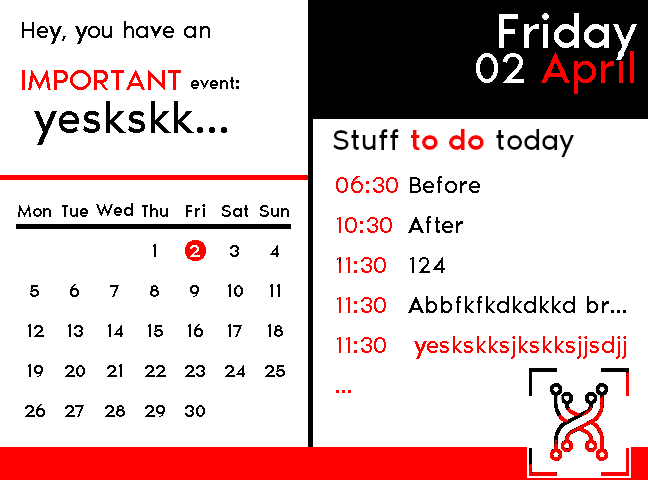

# Honest E-ink Calendar

This project is based on a waveshare 5.83 e-ink screen and a raspberry pi zero. The goal is to have a "nice" e-ink display inspired by the honest weather app. Example of honest weather app [here](https://play.google.com/store/apps/details?id=com.codinghard.honestweather&hl=en_US&gl=US).

The calendar use the google calendar api to retreive your event. If an the title of the event start with **!h**, the event will be interpreted as an highlighted event and will be displayed differently.


Here is an example of what the e-ink screen can look like.



## Requirement

## Software

To run this software you will need python3, pip3 and cron if you want to schedule the launch of the script.

## Python

You will need to install the waveshare e-ink library. Follow the instruction  on there git [here](https://github.com/waveshare/e-Paper/tree/master/RaspberryPi_JetsonNano/python). 

You will also need the google calendar api python library. Instruction [here](https://developers.google.com/calendar/quickstart/python). You will have to create a Google Cloud Platform project with the API enabled and create some Oauth credential. Those credentials will give you a _.json_ file that is in the case of this code here: ```/home/pi/credentials.json```


## Schedule with cron task

It's easy to schedule the refresh of the screen with a cron task. Here is a simple example to schedule the refresh once a day at 00:10.

First you need to open the cron file with the command ```crontab -e```.

Then you can simply add the following line: 

```
10 00 * * * /usr/bin/python3.7 /home/pi/e-ink-calendar.py >> cron.log 2>&1
```` 

Note that you may have to change the path of python and the e-ink-calendar.py file